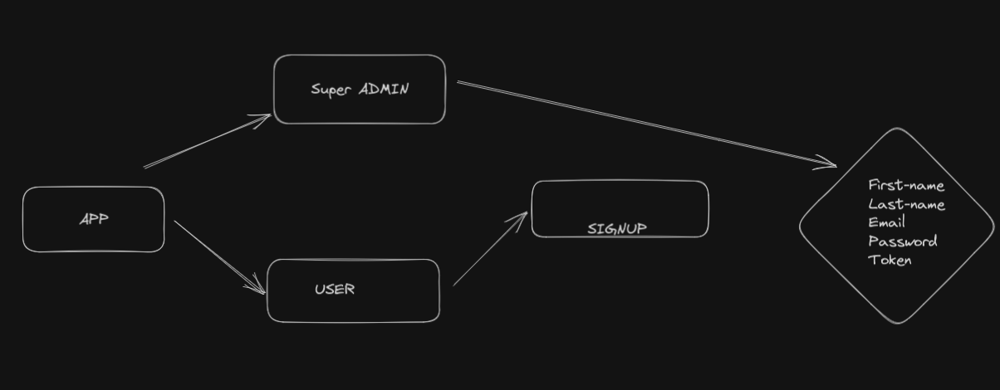

## MERN Authentication system Basic

### This is a basic mern authentication system which has 4 routes

1. Login
1. Register
1. Logout
1. Dashboard

- The dashboard is only accesible if the user is logged in otherwise the user is redirected to login page.

- Once user registers/logs in the token is saved in the local storage which is sent into headers with every request and the backend checks for it and if valid the user is allowed to view the dashboard page.

- If the token is invalid/expired user is not allowed to view the dashboard page.

- After log in if the user tries to visit the login page again they are redirected back to the dashboard

Schema design tool miro,sqldbm